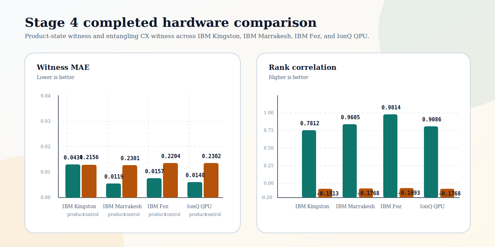

# Q-RoPE Stage 4 Hardware Comparison v1

Date: 2026-05-19

## BLUF

The active machine-verifiable hardware sweep records three completed artifacts: the original IBM Fez product-state hardware packet, an IBM Fez entangling-CX hardware packet, and an Amazon Braket/Rigetti product-state replication artifact. Additional IBM targets are deferred from the active sweep. Amazon Braket/IonQ is excluded from the active sweep because the checked IonQ devices were unavailable.

The completed active records preserve the same qualitative pattern:

- witness metrics were substantially better than the control metrics
- the IBM Fez control rank correlation remained negative
- the Braket/Rigetti control rank correlation remained below the witness rank correlation
- IBM Fez used 4096 shots
- IBM Fez CX used 4096 shots and preserved witness/control ordering
- Amazon Braket/IonQ was checked on 2026-05-19 and was not run because `Forte-1` and `Forte-Enterprise-1` were `OFFLINE`, while `Aria-1` was `RETIRED`
- Amazon Braket/Rigetti completed the product-state lane with 1000 shots per row on `Cepheus-1-108Q`

## Visual Summary

The figure is historical comparison context. The canonical active sweep evidence is the manifest and verifier output under `logs/automated_stage_gates/stage4_hardware_sweep/`.

- the active IBM Fez and Braket/Rigetti records recompute from raw counts
- deferred IBM rows are not active public evidence until real artifacts are added

## Hardware Targets

| Provider | Backend | Shots used | Status | Outcome |
| --- | --- | ---: | --- | --- |
| IBM Runtime | `ibm_fez` | 4096 | PASS | hardware-positive |
| Amazon Braket | `Rigetti Cepheus-1-108Q` | 1000 | PASS | hardware-positive |

## Product-State Witness

Circuit family: `two_qubit_zz_expectation_phase_wrap_v1`

| Backend | Witness MAE | Witness rank corr | Control MAE | Control rank corr |
| --- | ---: | ---: | ---: | ---: |
| `ibm_fez` | 0.018382 | 0.876558 | 0.217262 | -0.176940 |
| `rigetti_cepheus_1_108q` | 0.069901 | 0.786644 | 0.149995 | 0.121232 |

## Entangling CX Witness

Circuit family: `two_qubit_cx_parity_phase_wrap_v2`

The CX witness is now an active machine-verifiable IBM Fez hardware sweep record. The IBM Fez CX run used 16 rows and 4096 shots, completed as job `d86e50lg7okc73el0fog`, and verified as hardware-positive:

| Backend | Witness MAE | Witness rank corr | Control MAE | Control rank corr |
| --- | ---: | ---: | ---: | ---: |
| `ibm_fez` | 0.021458 | 0.972455 | 0.212516 | -0.169318 |

A no-hardware ideal-count rehearsal remains present at `logs/automated_stage_gates/stage4_cx_rehearsal/ideal_counts_rehearsal/`. An Amazon Braket/Rigetti CX hardware attempt was also submitted on 2026-05-19, but the task timed out while queued and was cancelled; it produced no raw counts and is not CX evidence.

## Comparison

### Product-state vs entangling

The entangling CX witness is used for the active public hardware sweep on IBM Fez only. It supports a bounded packet/backend/date/calibration-specific result, not a broad entanglement advantage or cross-backend robustness claim.

### Backend deltas

| Backend | MAE delta, product | Rank delta, product |
| --- | ---: | ---: |
| `ibm_fez` | 0.1989 | 1.0535 |
| `rigetti_cepheus_1_108q` | 0.0801 | 0.6654 |

Here the MAE delta is `control MAE - witness MAE`, so larger is better. The rank delta is `witness rank correlation - control rank correlation`, so larger is better.

### Excluded IonQ target

The active sweep does not require additional IBM machines. IBM Kingston and IBM Marrakesh are deferred from the active verifier path because the distinct value-add over the committed IBM Fez plus Braket/Rigetti artifacts is not enough to justify requiring extra hardware evidence for the current bounded claim.

The current intended IonQ route is Amazon Braket, not direct IonQ API execution. A read-only Braket device check on 2026-05-19 found `arn:aws:braket:us-east-1::device/qpu/ionq/Forte-1` and `arn:aws:braket:us-east-1::device/qpu/ionq/Forte-Enterprise-1` in `OFFLINE` status and `arn:aws:braket:us-east-1::device/qpu/ionq/Aria-1` in `RETIRED` status. No Braket/IonQ Stage 4 task was submitted, and no IonQ hardware artifact is present in the repository.

### Amazon Braket / Rigetti

The Braket/Rigetti product-state run completed after adding a Braket-specific preparation and execution adapter. It used 8 frozen rows with 1000 shots per row on `Cepheus-1-108Q`. The witness beat control on both declared metrics:

- witness MAE: `0.069901` vs control MAE: `0.149995`
- witness rank correlation: `0.786644` vs control rank correlation: `0.121232`
- offline verifier: `pass=true`

This run should be treated as a bounded cross-provider replication artifact, not as a broad robustness proof.

### Machine-verification status

The canonical sweep manifest is:

`logs/automated_stage_gates/stage4_hardware_sweep/manifest.json`

The offline sweep verifier is:

`scripts/verify_stage4_hardware_sweep.py`

Current repository state distinguishes active sweep records from deferred or excluded targets:

- The IBM Fez 4096-shot artifact is present and recomputable from raw counts.
- The Amazon Braket/Rigetti 1000-shot artifact is present and recomputable from raw counts.
- Additional IBM Kingston/Marrakesh hardware rows are deferred, not active verifier records.
- The CX no-hardware rehearsal passes and is explicitly marked as non-hardware readiness evidence.
- The CX Braket/Rigetti hardware attempt timed out while queued and produced no raw counts.
- The IBM Fez CX hardware artifact is present and recomputable from raw counts.
- The sweep verifier passes for the active records.
- IonQ is not an active sweep record. The manifest records it only under excluded targets because the checked Amazon Braket IonQ devices were unavailable on 2026-05-19, so IonQ hardware tests could not be run from the checked AWS account.

Deferred IBM rows should not be treated as machine-verifiable public evidence until the real run records, job IDs, raw counts, backend metadata, and verifier outputs are added. For IonQ specifically, a future artifact should be labeled as a new dated Amazon Braket/IonQ run if a Braket IonQ device becomes available, and then added as a new manifest record.

### Family-level summary

| Family | Best witness MAE | Best witness rank corr | Worst control MAE | Worst control rank corr |
| --- | ---: | ---: | ---: | ---: |
| Product-state | 0.018382 | 0.876558 | 0.217262 | -0.176940 |

### Goal status

The active evidence packaging goals are complete:

1. verify the existing IBM Fez product-state hardware packet from committed raw counts
2. add an Amazon Braket/Rigetti product-state replication artifact with completed task ARNs and S3 result URIs
3. record IonQ unavailability without promoting a missing IonQ run
4. add a no-hardware CX ideal-count rehearsal
5. add a completed IBM Fez CX hardware artifact with raw counts and verifier recomputation
6. keep additional IBM hardware execution lanes deferred unless real artifacts are later added

## Evidence Pointers

- [Product-state IBM packet logs](/C:/Users/Dan/Desktop/Projects/QuantyraQRope-sync/logs/automated_stage_gates/stage4_hardware_packet)
- [IBM Fez CX artifact](/C:/Users/Dan/Desktop/Projects/QuantyraQRope-sync/logs/automated_stage_gates/stage4_hardware_sweep/ibm_runtime__ibm_fez/two_qubit_cx_parity_phase_wrap_v2_20260519T222219Z)
- [Amazon Braket/Rigetti 1000-shot artifact](/C:/Users/Dan/Desktop/Projects/QuantyraQRope-sync/logs/automated_stage_gates/stage4_hardware_sweep/amazon_braket__arn_aws_braket_us-west-1__device_qpu_rigetti_Cepheus-1-108Q/two_qubit_zz_expectation_phase_wrap_v1_20260519T100942Z)
- [CX no-hardware rehearsal](/C:/Users/Dan/Desktop/Projects/QuantyraQRope-sync/logs/automated_stage_gates/stage4_cx_rehearsal/ideal_counts_rehearsal)
- [Stage 4 sweep manifest](/C:/Users/Dan/Desktop/Projects/QuantyraQRope-sync/logs/automated_stage_gates/stage4_hardware_sweep/manifest.json)
- [Stage 4 sweep verifier](/C:/Users/Dan/Desktop/Projects/QuantyraQRope-sync/scripts/verify_stage4_hardware_sweep.py)
- [Stage 4 sweep runner](/C:/Users/Dan/Desktop/Projects/QuantyraQRope/scripts/run_stage4_hardware_sweep.py)

## Recommendation

The next step is review packaging, not more execution:

1. fold these run results into the publication docs
2. describe the entangling witness as active IBM Fez hardware evidence with narrow claim boundaries
3. keep the 4096-shot wording for IBM and explicitly note that Amazon Braket/IonQ was unavailable during the 2026-05-19 check
